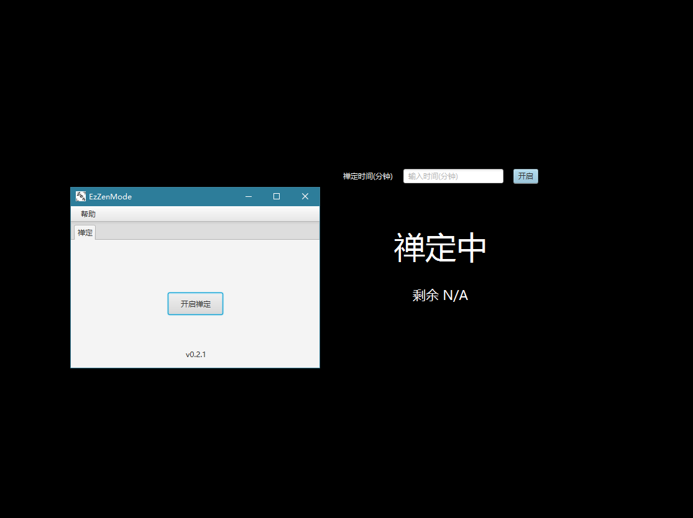

# EzZenMode

简易禅定模式,使用JavaFX开发

## 版权与许可

Copyright 2022 Winterreisender.

Licensed under GNU Affero General Public License Version 3 (AGPL-3.0-only)

This program is free software: you can redistribute it and/or modify it under the terms of the GNU Affero General Public License as published by the Free Software Foundation, only version 3 of the License.

This program is distributed in the hope that it will be useful, but WITHOUT ANY WARRANTY; without even the implied warranty of MERCHANTABILITY or FITNESS FOR A PARTICULAR PURPOSE. See the GNU Affero General Public License for more details.

You should have received a copy of the GNU Affero General Public License along with this program. If not, see <https://www.gnu.org/licenses/>.

## 引用

本程序使用了以下开源软件:

| 软件     |许可|
|--------|---|
| JavaFX | [GPL with the classpath exception](https://openjdk.java.net/legal/gplv2+ce.html) |